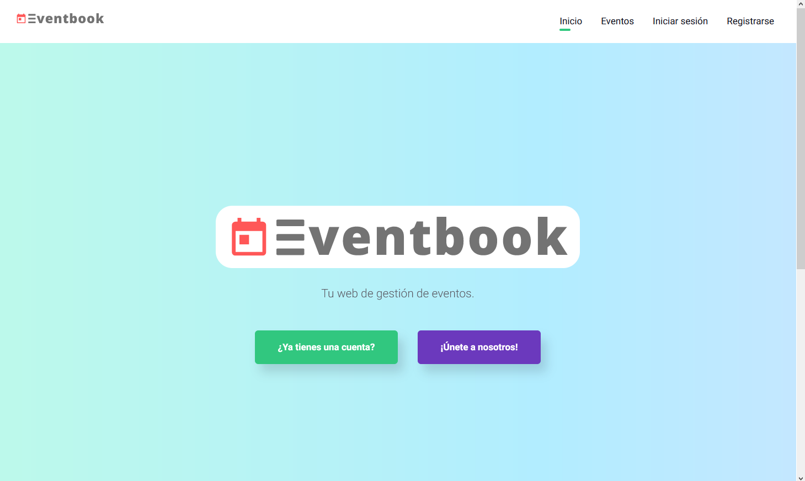
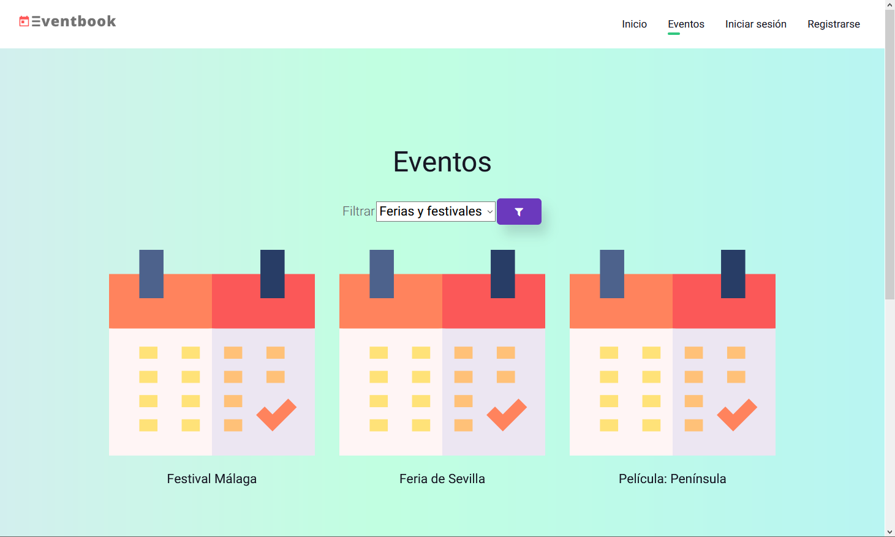
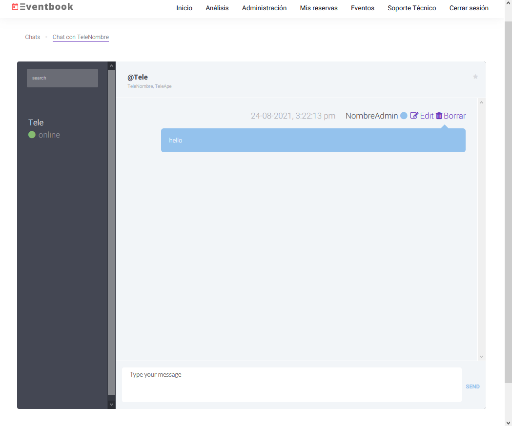
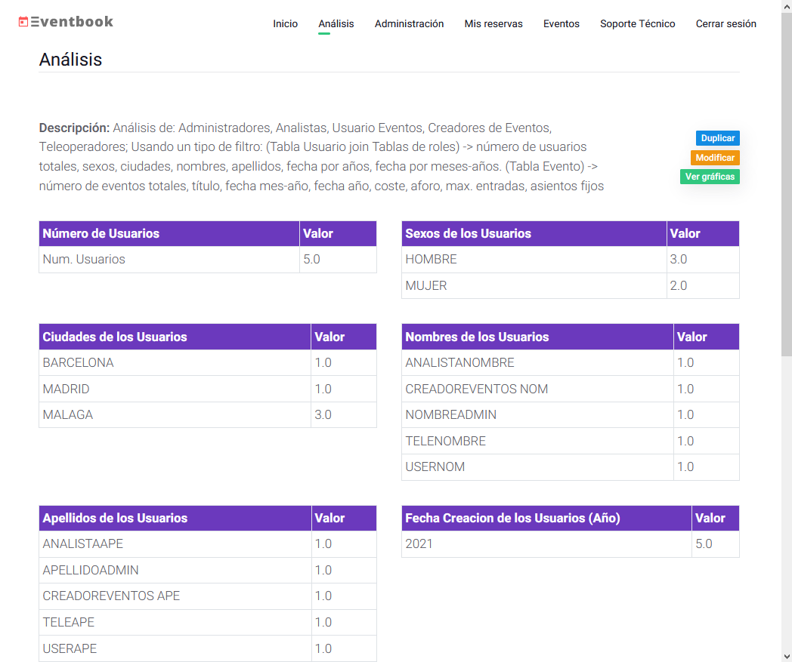
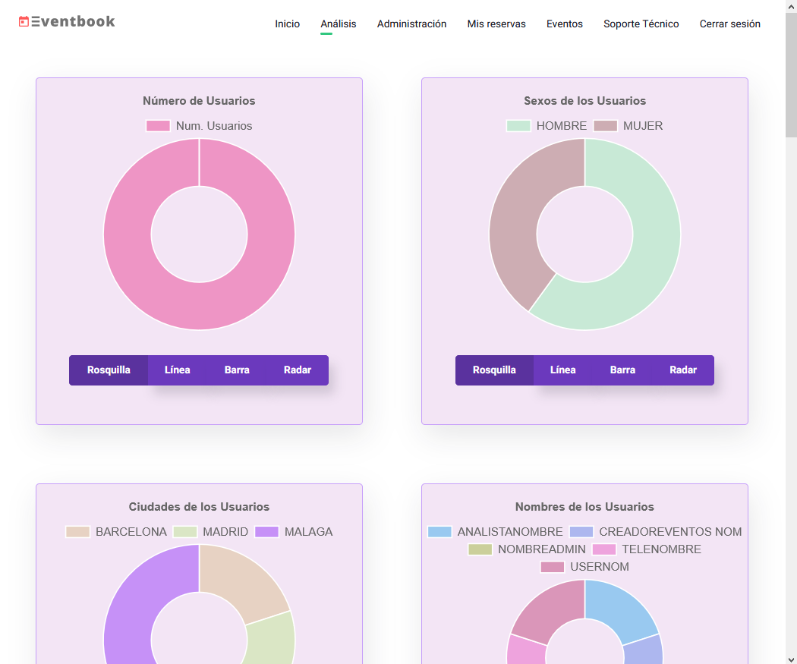
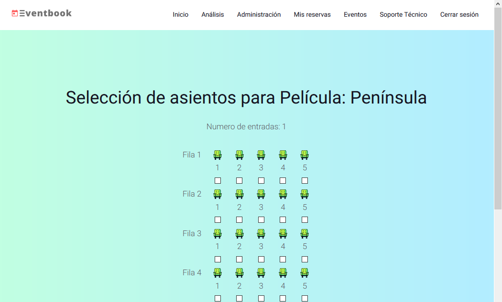
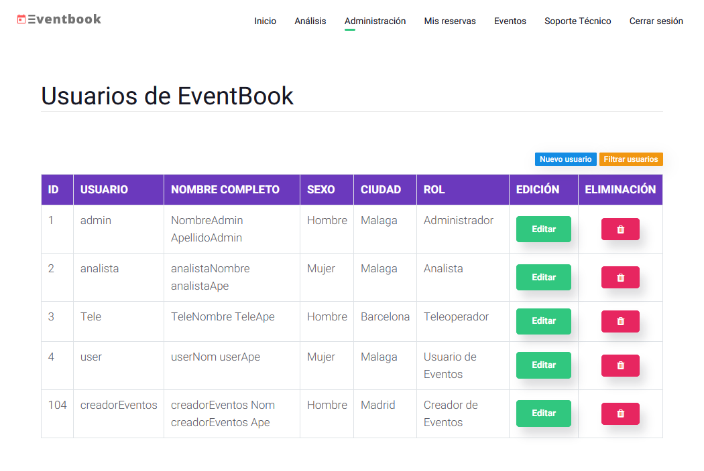

 

  

  

    Eventbook es una herramienta para hacer de la gestión de tu próximo evento lo más sencilla posible. 

# Intro

En nuestra plataforma, es posible realizar desde una gestión de usuarios con control de accesos por login, sistema de soporte técnico y administración, gestión de reservas hasta realizar análisis estadísticos de todos los usuarios del sistema.

# Tecnologías utilizadas

* Spring Boot
* Apache Derby + Tomcat
* Selenium para la automatización de las pruebas de usuario

# Funcionalidades

* Gestion de usuarios por login.
* Sistema de chat en tiempo real y mensajería.
* Administración de usuarios y roles.
* Gestión de reservas y eventos.
* Análisis estadísticos del sistema.

# Screenshots

    
    
    
    
    
    
    

